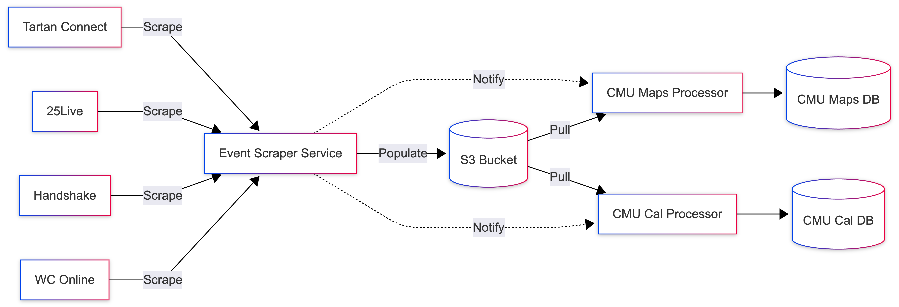

# Event Scraper

The Event Scraper service scrape data and upload them to S3 bucket from the following sources:

- 25Live
- Handshake
- Tartan Connect

Then the Event Scraper service notifies the Railway services defined in the `NOTIF_CONFIG` environment variable to restart their deployments, which are responsible for pulling the data from S3 bucket and processing them.

## Data Flow


*Use code from [docs/data-flow.txt](./docs/data-flow.txt) to generate the diagram in [Mermaid](https://www.mermaidchart.com/play).*

## Accessing the Scraped Data

Consult the [internal Notion documentation](https://www.notion.so/wiki-scottylabs/Event-Scraper-2b496192554c80f8bd55d8cd108fcd78)
for information on accessing the scraped data. Ask someone in ScottyLabs leadership if you don't have access to the Notion document.

## Development

Open the project with Dev Container. Populate the environment variables following the [env.ts](./src/env.ts) file. Most secrets are stored in Railway but you would need to supply your own CMU credentials. To run the service locally, run the following command:

```bash
bun src/index.ts
```

## FAQs

### Data Flow Rationale

The CMU password in Railway is sealed. However, it can be obtained by logging it, so we want to limit the number of people having access to this repo... Therefore this repo is only used to scrape the data and upload them to S3 bucket. The data processing should be done in different repos.

### Why are environment secrets only stored in Railway?

If someone need access to the RAILWAY_TOKEN, then they should have access to Railway already.
