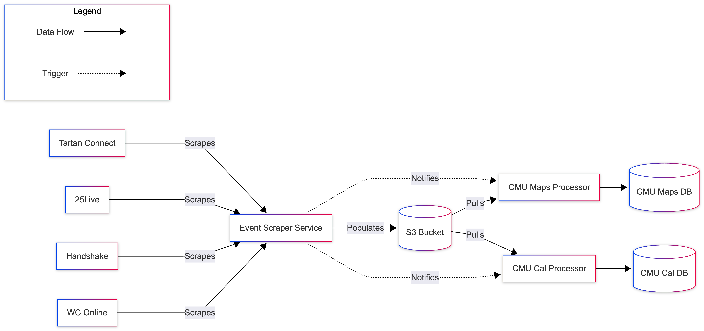

# Event Scraper

The Event Scraper service scrapes data and uploads them to an S3 bucket from the
following sources:

- [25Live](https://25live.collegenet.com/25live/data/cmu/run/home/calendar/calendardata.json?mode=pro&compsubject=location):
  the CMU room reservation data for the next 7 days.

- [Handshake](https://app.joinhandshake.com/login?ref=app-domain&selected_host=cmu.joinhandshake.com):
  the CMU Handshake events for the next 30 days.

- [Tartan Connect](https://tartanconnect.cmu.edu/mobile_ws/v17/mobile_events_list?range=0):
  the CMU Tartan Connect events.

Then the Event Scraper service notifies the Railway services defined in the
`NOTIF_CONFIG` environment variable to restart their deployments,
which are responsible for pulling the data from S3 bucket and processing them.

## System Design


*You can regenerate this diagram by pasting the [linked code](./docs/system-design.txt)
into [Mermaid](https://www.mermaidchart.com/play).*

## Accessing the Scraped Data

See [Contributing Guide](.github/CONTRIBUTING.md) for instructions on
how to access the S3 bucket credentials.

## Development

Open the project with Dev Container. Populate the environment variables following
the [env.ts](./src/env.ts) file. Most secrets are stored in Railway but you would
need to supply your own CMU credentials. To run the service locally, run the
following command:

```bash
bun src/index.ts
``
